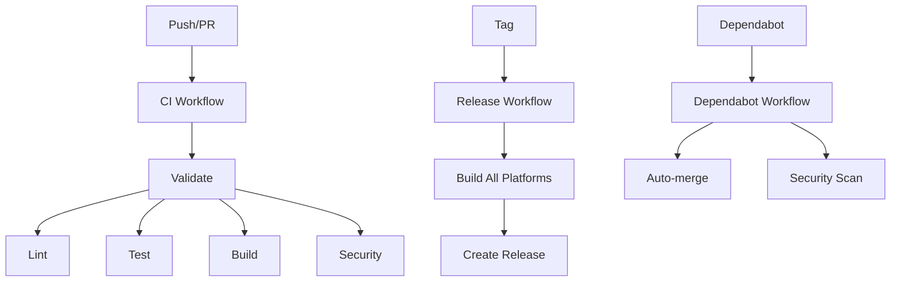

# GitHub Actions Workflows

This directory contains GitHub Actions workflows for automated CI/CD, testing, building, and releasing the TCP-over-Nostr project.

## Workflows Overview

### 1. CI Workflow (`ci.yml`)
**Trigger:** Push to main/develop, PRs, manual dispatch
**Purpose:** Fast validation and basic testing

- **Validate**: Checks Go module integrity and file changes
- **Lint**: Runs golangci-lint for code quality
- **Test**: Runs unit tests with race detection
- **Build**: Builds binaries for main platforms (Linux, Windows, macOS)
- **Docker**: Builds Docker image for main branch
- **Security**: Runs security scans with Gosec

### 2. Build Workflow (`build.yml`)
**Trigger:** Push to main/develop, PRs, manual dispatch
**Purpose:** Comprehensive cross-platform builds

- **Test**: Full test suite with coverage
- **Lint**: Comprehensive linting
- **Build**: Builds for all supported platforms:
  - Linux: amd64, arm64, 386, arm
  - Windows: amd64, 386, arm64
  - macOS: amd64, arm64

### 3. Test Workflow (`test.yml`)
**Trigger:** Push to main/develop, PRs, manual dispatch
**Purpose:** Comprehensive testing and quality assurance

- **Test Suite**: Tests across multiple OS and Go versions
- **Lint and Format**: Code formatting and style checks
- **Security**: Security vulnerability scanning
- **Build Test**: Verifies build process works correctly
- **Integration Test**: End-to-end testing (main branch only)
- **Coverage Report**: Generates and combines coverage reports

### 4. Release Workflow (`release.yml`)
**Trigger:** Git tags (v*), manual dispatch
**Purpose:** Automated releases

- **Build Binaries**: Creates binaries for all platforms
- **Generate Checksums**: Creates SHA256 checksums
- **Create Release**: Generates GitHub release with assets
- **Update Version**: Updates version.go after release

### 5. Dependabot Workflow (`dependabot.yml`)
**Trigger:** Dependabot PRs
**Purpose:** Automated dependency management

- **Auto-merge**: Automatically merges minor/patch updates
- **Security Scan**: Scans dependencies for vulnerabilities

## Configuration Files

### Dependabot (`dependabot.yml`)
Automatically updates:
- Go modules (weekly)
- GitHub Actions (weekly)

## Supported Platforms

### Binary Builds
- **Linux**: amd64, arm64, 386, arm
- **Windows**: amd64, 386, arm64
- **macOS**: amd64, arm64

## Secrets Required

The workflows use the following secrets (automatically provided by GitHub):

- `GITHUB_TOKEN`: For GitHub API access
- No additional secrets required for basic functionality

## Environment Variables

- `GO_VERSION`: Go version to use (currently 1.24)
- `BINARY_NAME`: Name of the built binary (tcp-proxy)

## Artifacts

### Build Artifacts
- Binary files for each platform
- SHA256 checksums
- Coverage reports
- Security scan reports

## Workflow Dependencies

## Usage

### Manual Release
1. Update version in `version.go`
2. Create and push a git tag: `git tag v1.0.0 && git push origin v1.0.0`
3. The release workflow will automatically create a GitHub release

### Manual Build
1. Go to Actions tab in GitHub
2. Select "Build" workflow
3. Click "Run workflow"
4. Select branch and click "Run workflow"

### Viewing Results
- **Build Artifacts**: Available in the Actions tab for 30 days
- **Coverage Reports**: Available as artifacts and in PR comments
- **Security Reports**: Available in the Security tab

## Troubleshooting

### Common Issues
1. **Build Failures**: Check Go version compatibility
2. **Test Failures**: Check for race conditions or flaky tests
3. **Security Scan Failures**: Review and fix security vulnerabilities

### Debugging
- Check workflow logs in the Actions tab
- Review artifact contents
- Verify environment variables and secrets
- Check for dependency conflicts

## Contributing

When adding new workflows or modifying existing ones:

1. Test changes in a feature branch first
2. Ensure workflows are idempotent
3. Add appropriate error handling
4. Update this README if needed
5. Consider security implications
